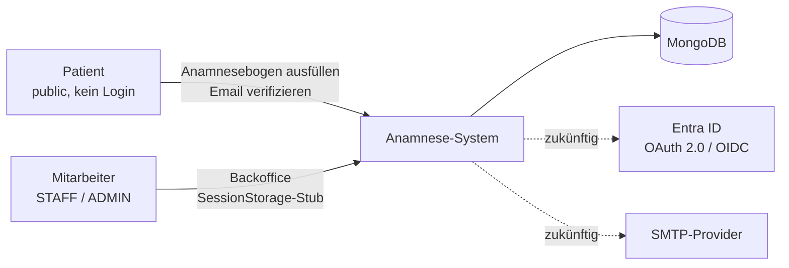
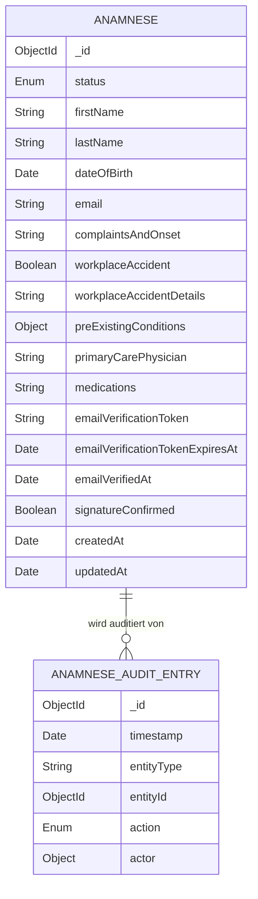
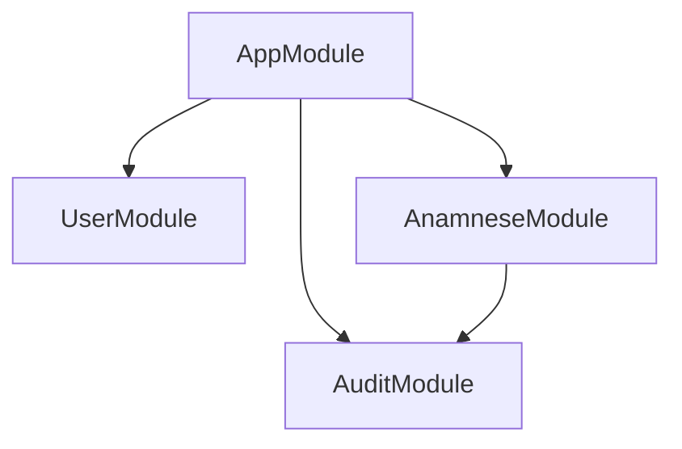
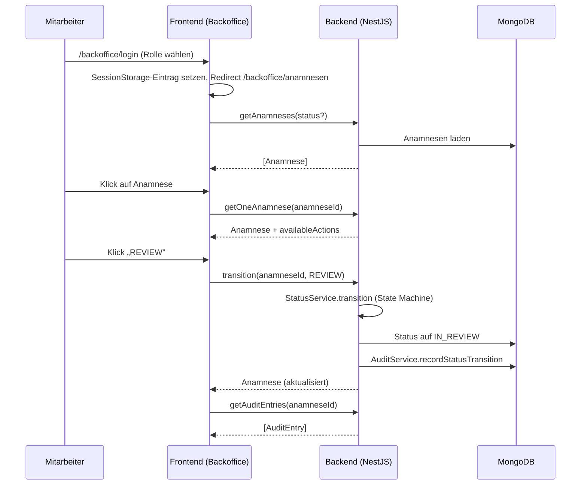

# Architektur

> Status: Akzeptiert
> Letztes Update: 2026-05-11

Dieses Papier zieht die anderen Konzeptpapiere zusammen und beschreibt das System auf Architektur-Ebene. Die einzelnen Konzepte (Auth, Statusmodell, Audit, SSO) sind in eigenen Papieren ausgearbeitet und werden hier referenziert, nicht dupliziert.

## Kontext und Ziele

Web-Anwendung der Schön Klinik zur Erfassung und Verwaltung von Anamnesebögen. Zwei klar getrennte Bereiche:

- **Public:** Patient ruft den Anamnesebogen ohne Login auf, füllt ihn aus, bestätigt per Email-Verifikation
- **Backoffice:** Mitarbeitende mit Login (STAFF, ADMIN) sichten Bögen und verwalten den Lebenszyklus über ein Statusmodell

Die einzelnen Konzeptpapiere beschreiben jeweils die Trennung Demo vs. Konzept.

## Kontextdiagramm



## Akteure und Rollen

| Akteur | Rolle | Auth | Zugriff |
|---|---|---|---|
| Patient | (keine, public) | keine (Server-Side Validation) | Anamnese ausfüllen, Email verifizieren |
| Mitarbeiter | `STAFF` | SessionStorage-Stub (Demo) | Anamnesen einsehen und Status verwalten |
| Admin | `ADMIN` | konzeptuell, nicht implementiert | wie STAFF, zusätzlich Audit-Log-Zugriff |
| System | (automatisch) | Service-intern | Email-Verifikations-Übergänge |

## Domänen-Modell

### Beziehungen



### Aggregat-Grenzen

- **Anamnese**: alle Felder eingebettet, keine Sub-Entitäten (Medikamente als Freitext, kein 1-zu-n)
- **AnamneseAuditEntry**: eigene Aggregat-Wurzel, append-only
- **User**: Schema vorhanden, in der Demo kein funktionales Aggregat (kein Service, kein Login)

### Anamnese: Felder im Detail

| Feld | Typ | Bedeutung |
|---|---|---|
| `_id` | ObjectId | technische ID |
| `status` | Enum | siehe `docs/statusmodell.md` |
| `firstName` | String | Stammdaten |
| `lastName` | String | Stammdaten |
| `dateOfBirth` | Date | Stammdaten |
| `email` | String | Pflicht für Verifikations-Flow |
| `complaintsAndOnset` | String | Beschwerden und Beginn (Freitext) |
| `workplaceAccident` | Boolean | Arbeitsunfall ja/nein |
| `workplaceAccidentDetails` | String, optional | BG und Aktenzeichen, conditional auf `workplaceAccident=true` |
| `preExistingConditions` | `{ selected: [Enum], other?: String }` | Multi-Select mit Sonstiges |
| `primaryCarePhysician` | String | Hausarzt (Freitext) |
| `medications` | String | Medikamente (Freitext) |
| `emailVerificationToken` | String, optional | kryptografisch zufällig, einmalig konsumiert |
| `emailVerificationTokenExpiresAt` | Date, optional | 24h ab Submit |
| `emailVerifiedAt` | Date, optional | Zeitstempel des Klicks |
| `signatureConfirmed` | Boolean | Checkbox-Bestätigung |
| `createdAt`, `updatedAt` | Date | Mongoose-Timestamps |
| `availableActions` | `AnamneseAction[]` | berechnetes Feld (nicht in DB), abgeleitet aus `status` via `getAvailableActions()` |

### User: Felder

Schema vorhanden, aber kein UserService implementiert. User-Verwaltung ist in der Demo nicht funktional — das Backoffice nutzt einen SessionStorage-Stub ohne echte Benutzerkonten.

| Feld | Typ | Bedeutung |
|---|---|---|
| `_id` | ObjectId | technische ID |
| `email` | String, unique | Login-Identifier |
| `passwordHash` | String | Argon2id |
| `role` | Enum | `STAFF` oder `ADMIN` |
| `createdAt` | Date | Mongoose-Timestamp |

### AnamneseAuditEntry: Felder

| Feld | Typ | Bedeutung |
|---|---|---|
| `_id` | ObjectId | technische ID |
| `timestamp` | Date | Ereignis-Zeitpunkt |
| `entityType` | String | `"Anamnese"` |
| `entityId` | ObjectId | Referenz auf Anamnese |
| `action` | Enum | `CREATE`, `EMAIL_VERIFIED`, `STATUS_TRANSITION` (siehe `docs/audit-log-konzept.md`) |
| `actor` | `{ type, userId?, role? }` | Akteur-Sub-Doc |

### Indizes

Nicht explizit gesetzt in der Demo. Konzeptuell sinnvoll für Produktion:

| Collection | Index | Zweck |
|---|---|---|
| `users` | `email` (unique) | Login-Lookup |
| `anamnese` | `status` | Filter im Backoffice |
| `anamnese` | `emailVerificationToken` (unique sparse) | Token-Lookup |
| `anamnese` | `createdAt` | Sortierung in Liste |
| `anamnese_audit_entries` | `entityId, timestamp` | Audit-Verlauf pro Anamnese |

## Backend-Architektur (NestJS)

### Modulstruktur



### Module

| Modul | Verantwortung |
|---|---|
| `AppModule` | Root, GraphQL-Setup über `@nestjs/graphql` Code-First, Mongoose-Connection |
| `UserModule` | User-Schema (Stub, kein Service) |
| `AnamneseModule` | Anamnese-Schema, AnamneseService, StatusService, getrennte Resolver public/backoffice |
| `AuditModule` | AnamneseAuditEntry-Schema, AuditService, AuditResolver |

### Layered Architecture pro Feature-Modul

- **Resolver-Layer**: GraphQL-Resolver, Input-DTO-Validation, Guard-Anwendung
- **Service-Layer**: Geschäftslogik (z.B. State Machine in `StatusService`)
- **Repository-Layer**: Mongoose-Models, gekapselt im Service

### Auth-Strategien

Public- und Backoffice-Operationen sind als getrennte Resolver implementiert. In der Demo hat das Backend keinen Auth-Guard — alle Endpunkte sind technisch erreichbar. Der Zugangsschutz erfolgt ausschließlich im Frontend über den `canActivate`/`canActivateChild`-Guard.

## Frontend-Architektur (Angular)

### App-Struktur

```
apps/frontend/src/app/
├── app.config.ts                     ApplicationConfig: Router, Apollo
├── app.ts                            Root, <router-outlet>
├── app.routes.ts                     Top-level Routes
├── shared/                           geteilte Komponenten
├── graphql/                          Codegen-Output
├── public/
│   ├── public.routes.ts
│   └── anamnese/                     Formular + Bestätigungsseite
└── backoffice/
    ├── backoffice.routes.ts
    ├── backoffice-layout.component/  Navigation + <router-outlet>
    ├── login/
    └── anamnesen/
        ├── anamnesen-list.component
        └── detail/                   Detail + Aktionen + Audit-Log
```

### Routing

Backoffice-Routen liegen unter einem `BackofficeLayoutComponent` als Parent-Route mit `canActivate` und `canActivateChild`. Der `authGuard` prüft bei jeder Navigation den SessionStorage-Eintrag und leitet auf `/backoffice/login` um falls nicht vorhanden.

### State Management

Signals plus RxJS in Services. Kein NgRx (siehe ADR-0005).

- `AuthService`: Login-Status über SessionStorage, `isLoggedIn()` als Methode
- Apollo Client für GraphQL. Refetch nach Mutations als Demo-Pattern statt manueller Cache-Updates
- Komponentenlokal: `signal()` für geladene Anamnese und Audit-Einträge, `computed()` für abgeleitete Werte

## GraphQL-Schema-Übersicht

### Public Operations (Rate Limit, kein User-Auth)

| Operation | Input | Output |
|---|---|---|
| `createAnamneseSubmission` (Mutation) | `CreateAnamneseInput` | `SubmissionResult { success: Boolean!, verificationLinkForDemo: String! }` |
| `verifyAnamneseEmail` (Mutation) | `token: String!` | `VerificationResult { success: Boolean! }` |

Beide Public-Mutations geben eigene Result-Types zurück. Der `Anamnese`-Type wird nicht ans Public-Schema exponiert.

### Backoffice Operations (kein Backend-Guard in Demo)

| Operation | Input | Output |
|---|---|---|
| `getAnamneses` (Query) | `status?: AnamneseStatus` | `[Anamnese!]!` |
| `getOneAnamnese` (Query) | `anamneseId: String!` | `Anamnese!` |
| `transition` (Mutation) | `anamneseId: String!, action: AnamneseAction!` | `Anamnese!` |
| `getAuditEntries` (Query) | `anamneseId: String!` | `[AuditEntry!]!` |

### DTO-Strategie

Input-DTOs sind eigenständige `@InputType()`-Klassen mit `class-validator`-Dekoratoren. Im Frontend werden Types über GraphQL-Codegen aus dem Backend-Schema generiert.

## Sequenzdiagramm: Mitarbeiter-Workflow



Weitere Sequenzdiagramme in den jeweiligen Konzeptpapieren:

- Patient-Flow (Submit + Email-Verifikation): `docs/auth-public-bogen.md`
- OAuth 2.0 Authorization Code Flow mit PKCE: `docs/sso-konzept.md`

## Performance-Aspekte

| Aspekt | Demo | In Produktion |
|---|---|---|
| Pagination | kein Limit auf Listen-Queries (TODO im Code) | Cursor-based |
| Indizes | nicht gesetzt (nur impliziter unique-Index auf `user.email`) | nach Lastprofil definieren |
| Rate Limiting | nicht implementiert | NestJS Throttler auf Public-Endpoints |
| Connection Pooling | Mongoose-Default | identisch |

## Sicherheits-Aspekte (Querschnitt)

- Server-Side Validation auf Input-DTOs (`class-validator`)
- Public und Backoffice Operations als getrennte Resolver
- HTTPS in Produktion Pflicht
- Für Produktion vorgesehen (nicht in Demo): Helmet, JWT/OIDC-Guard, GraphQL Depth Limit, Introspection deaktivieren

## Verzeichnis-Struktur (Monorepo)

```
.
├── apps/
│   ├── backend/
│   │   ├── src/
│   │   │   ├── app.module.ts
│   │   │   ├── auth/
│   │   │   ├── user/
│   │   │   ├── anamnese/
│   │   │   ├── audit/
│   │   │   └── main.ts
│   │   ├── package.json
│   │   └── tsconfig.json
│   └── frontend/
│       ├── src/app/
│       ├── package.json
│       └── angular.json
├── docs/                              (dieses Repo)
├── docker-compose.yml
├── package.json                       (root, Convenience-Scripts für install und start)
└── README.md
```

## Verweise

### ADRs
- ADR-0001: Einzelrepository mit zwei eigenständigen Apps
- ADR-0002: Backend-Framework NestJS
- ADR-0003: MongoDB-Library Mongoose
- ADR-0004: GraphQL Code-First mit `@nestjs/graphql`
- ADR-0005: Frontend State Management mit Signals und Services
- ADR-0006: Backoffice-Auth als SessionStorage-Stub
- ADR-0007: Public-Auth mit Email-Verifikation

### Konzeptpapiere
- [docs/auth-public-bogen.md](auth-public-bogen.md): Public-Auth Detail
- [docs/statusmodell.md](statusmodell.md): Statusmodell und State Machine
- [docs/audit-log-konzept.md](audit-log-konzept.md): Audit-Log Detail
- [docs/sso-konzept.md](sso-konzept.md): Backoffice-Produktivkonzept SSO
