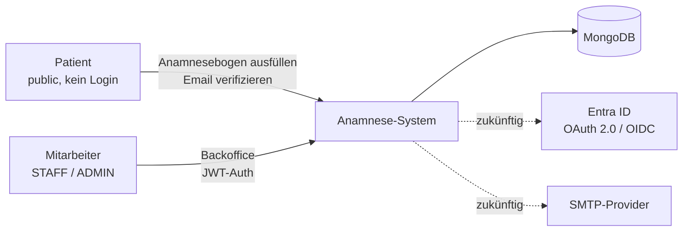
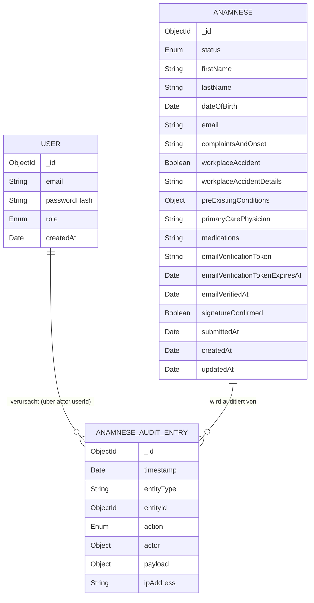
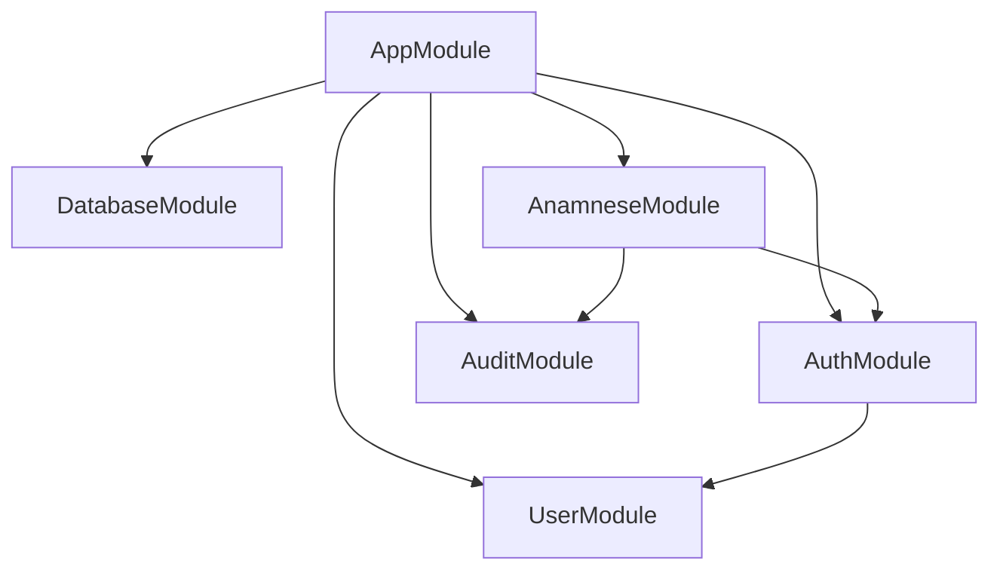
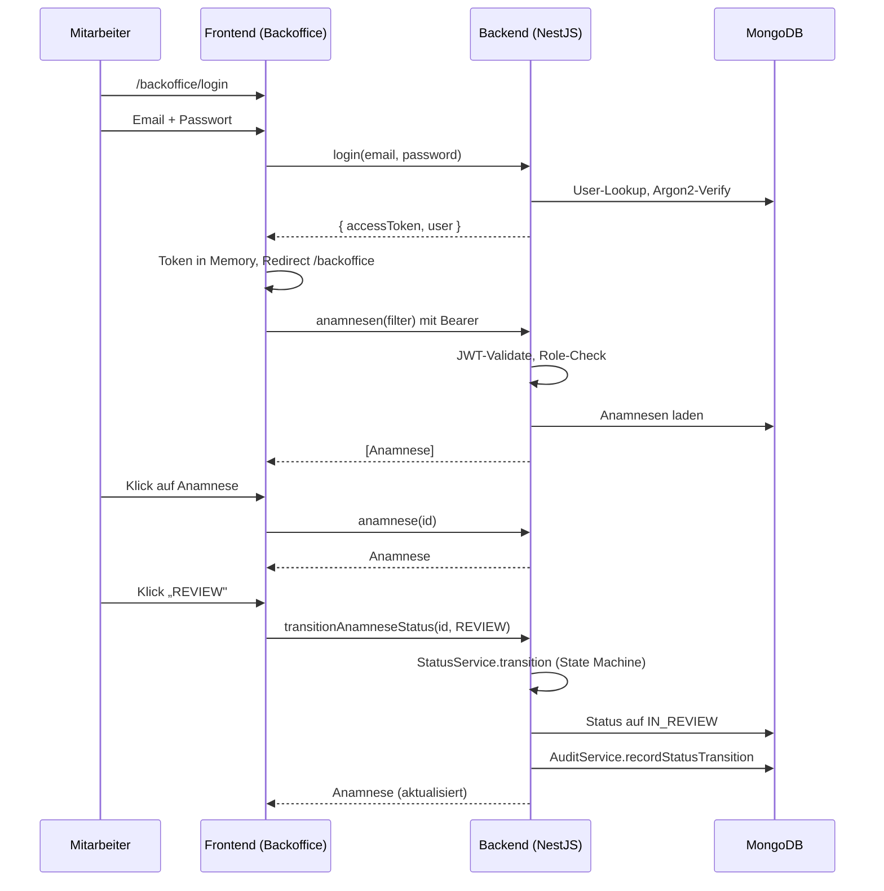

# Architektur

> Status: Akzeptiert
> Letztes Update: 2026-05-04

Dieses Papier zieht die anderen Konzeptpapiere zusammen und beschreibt das System auf Architektur-Ebene. Die einzelnen Konzepte (Auth, Statusmodell, Audit, SSO) sind in eigenen Papieren ausgearbeitet und werden hier referenziert, nicht dupliziert.

## Kontext und Ziele

Web-Anwendung der Schön Klinik zur Erfassung und Verwaltung von Anamnesebögen. Zwei klar getrennte Bereiche:

- **Public:** Patient ruft den Anamnesebogen ohne Login auf, füllt ihn aus, bestätigt per Email-Verifikation
- **Backoffice:** Mitarbeitende mit Login (STAFF, ADMIN) sichten Bögen und verwalten den Lebenszyklus über ein Statusmodell

Demo-Implementation gemäß Cut-Stufe 2 (siehe Working-Doc `aufgabenstellung-und-annahmen-julian.md` plus die einzelnen Konzeptpapiere für die Trennung Demo vs. Konzept).

## Kontextdiagramm



## Akteure und Rollen

| Akteur | Rolle | Auth | Zugriff |
|---|---|---|---|
| Patient | (keine, public) | Captcha + Rate Limit | Anamnese ausfüllen, Email verifizieren |
| Mitarbeiter | `STAFF` | Email/Passwort + JWT | Anamnesen einsehen und Status verwalten |
| Admin | `ADMIN` | Email/Passwort + JWT | wie STAFF, zusätzlich Audit-Log-Zugriff |
| System | (automatisch) | Service-intern | Email-Verifikations-Übergänge, später EXPIRED-Job |

## Domänen-Modell

### Beziehungen



### Aggregat-Grenzen

- **Anamnese**: alle Felder eingebettet, keine Sub-Entitäten (Medikamente als Freitext, kein 1-zu-n)
- **AnamneseAuditEntry**: eigene Aggregat-Wurzel, append-only
- **User**: eigene Aggregat-Wurzel

### Anamnese: Felder im Detail

| Feld | Typ | Bedeutung |
|---|---|---|
| `_id` | ObjectId | technische ID |
| `status` | Enum | siehe `docs/statusmodell.md` |
| `firstName` | String | Stammdaten |
| `lastName` | String | Stammdaten |
| `dateOfBirth` | Date | Stammdaten |
| `email` | String | Pflicht für Verifikations-Flow |
| `complaintsAndOnset` | String | Beschwerden und Beginn (Freitext) |
| `workplaceAccident` | Boolean | Arbeitsunfall ja/nein |
| `workplaceAccidentDetails` | String, optional | BG und Aktenzeichen, conditional auf `workplaceAccident=true` |
| `preExistingConditions` | `{ selected: [Enum], other?: String }` | Multi-Select mit Sonstiges |
| `primaryCarePhysician` | String | Hausarzt (Freitext) |
| `medications` | String | Medikamente (Freitext) |
| `emailVerificationToken` | String, optional | kryptografisch zufällig, einmalig konsumiert |
| `emailVerificationTokenExpiresAt` | Date, optional | 48h ab Submit |
| `emailVerifiedAt` | Date, optional | Zeitstempel des Klicks |
| `signatureConfirmed` | Boolean | Checkbox-Bestätigung |
| `submittedAt` | Date, optional | gesetzt beim Übergang nach `SUBMITTED` |
| `createdAt`, `updatedAt` | Date | Mongoose-Timestamps |

### User: Felder

| Feld | Typ | Bedeutung |
|---|---|---|
| `_id` | ObjectId | technische ID |
| `email` | String, unique | Login-Identifier |
| `passwordHash` | String | Argon2id |
| `role` | Enum | `STAFF` oder `ADMIN` |
| `createdAt` | Date | Mongoose-Timestamp |

### AnamneseAuditEntry: Felder

| Feld | Typ | Bedeutung |
|---|---|---|
| `_id` | ObjectId | technische ID |
| `timestamp` | Date | Ereignis-Zeitpunkt |
| `entityType` | String | `"Anamnese"` |
| `entityId` | ObjectId | Referenz auf Anamnese |
| `action` | Enum | `CREATE`, `EMAIL_VERIFIED`, `STATUS_TRANSITION` (siehe `docs/audit-log-konzept.md`) |
| `actor` | `{ type, userId?, role? }` | Akteur-Sub-Doc |
| `payload` | Object | action-specific |
| `ipAddress` | String, optional | bei Public-Aktionen |

### Indizes

| Collection | Index | Zweck |
|---|---|---|
| `users` | `email` (unique) | Login-Lookup |
| `anamnese` | `status` | Filter im Backoffice |
| `anamnese` | `emailVerificationToken` (unique sparse) | Token-Lookup |
| `anamnese` | `createdAt` | Sortierung in Liste |
| `anamnese_audit_entries` | `entityId, timestamp` | Audit-Verlauf pro Anamnese |
| `anamnese_audit_entries` | `action, timestamp` | Filter im Audit-UI (Konzept) |

## Backend-Architektur (NestJS)

### Modulstruktur



### Module

| Modul | Verantwortung |
|---|---|
| `AppModule` | Root, GraphQL-Setup über `@nestjs/graphql` Code-First, Config, Throttler |
| `DatabaseModule` | Mongoose-Connection, globale DB-Config |
| `AuthModule` | JWT-Strategy via `passport-jwt`, Guards (`JwtAuthGuard`, `RolesGuard`), Login-Mutation |
| `UserModule` | User-Schema, UserService (Lookup, Seed) |
| `AnamneseModule` | Anamnese-Schema, AnamneseService, StatusService, getrennte Resolver public/backoffice |
| `AuditModule` | AnamneseAuditEntry-Schema, AuditService, AuditResolver (ADMIN-guarded) |

### Layered Architecture pro Feature-Modul

- **Resolver-Layer**: GraphQL-Resolver, Input-DTO-Validation, Guard-Anwendung
- **Service-Layer**: Geschäftslogik (z.B. State Machine in `StatusService`)
- **Repository-Layer**: Mongoose-Models, gekapselt im Service

### Auth-Strategien

Public-Operationen sind ohne User-Auth, geschützt nur durch Rate Limit. Backoffice-Operationen sind hinter JWT-Guard plus optionalem Roles-Guard für ADMIN-only Queries.

```ts
@Resolver()
export class AnamnesePublicResolver {
  @Mutation()
  createAnamneseSubmission(...) { ... }

  @Mutation()
  verifyAnamneseEmail(...) { ... }
}

@Resolver()
@UseGuards(JwtAuthGuard)
export class AnamneseBackofficeResolver {
  @Query()
  anamnesen(...) { ... }

  @Query()
  @Roles('ADMIN')
  auditEntriesForAnamnese(...) { ... }
}
```

## Frontend-Architektur (Angular)

### App-Struktur

```
apps/frontend/src/app/
├── app.config.ts                     ApplicationConfig: Router, Apollo, Auth
├── app.component.ts                  Root, <router-outlet>
├── app.routes.ts                     Top-level Routes
├── shared/
│   ├── apollo.client.ts              Apollo Setup, Auth-Interceptor
│   ├── auth/
│   │   ├── auth.service.ts           Signal-basiert
│   │   ├── auth.guard.ts             Functional Guard
│   │   └── auth.interceptor.ts       Bearer-Token-Header
│   └── ui/                            geteilte UI-Komponenten
├── public/
│   ├── public.routes.ts              PUBLIC_ROUTES
│   ├── anamnese-form.component.ts    Standalone, Reactive Forms
│   └── verification-success.component.ts
└── backoffice/
    ├── backoffice.routes.ts          BACKOFFICE_ROUTES
    ├── login.component.ts
    ├── anamnese-list.component.ts
    └── anamnese-detail.component.ts
```

### Routing mit Lazy Loading (Standalone Components)

```ts
// app.routes.ts
export const APP_ROUTES: Routes = [
  { path: '', redirectTo: 'anamnese', pathMatch: 'full' },
  {
    path: 'anamnese',
    loadChildren: () => import('./public/public.routes').then(m => m.PUBLIC_ROUTES),
  },
  {
    path: 'backoffice',
    loadChildren: () => import('./backoffice/backoffice.routes').then(m => m.BACKOFFICE_ROUTES),
    canActivate: [authGuard],
  },
];

// backoffice/backoffice.routes.ts
export const BACKOFFICE_ROUTES: Routes = [
  { path: 'login', loadComponent: () => import('./login.component').then(m => m.LoginComponent) },
  { path: '', loadComponent: () => import('./anamnese-list.component').then(m => m.AnamneseListComponent) },
  { path: ':id', loadComponent: () => import('./anamnese-detail.component').then(m => m.AnamneseDetailComponent) },
];
```

Public-User lädt nur das Public-Bundle. Backoffice-Bundles werden erst nach Auth geladen.

### State Management

Signals plus RxJS in Services. Kein NgRx (siehe ADR-0005).

- `AuthService`: `signal<User | null>(null)`, abgeleitetes `isAuthenticated = computed(...)`, Token-Storage in Memory
- Apollo Client für GraphQL, mit lokalem Cache. Refetch nach Mutations als Demo-Pattern statt manueller Cache-Updates

## GraphQL-Schema-Übersicht

### Public Operations (Rate Limit, kein User-Auth)

| Operation | Input | Output |
|---|---|---|
| `createAnamneseSubmission` (Mutation) | `CreateAnamneseInput` | `SubmissionResult { success: Boolean!, verificationLinkForDemo: String! }` |
| `verifyAnamneseEmail` (Mutation) | `token: String!` | `VerificationResult { success: Boolean! }` |

Beide Public-Mutations geben eigene Result-Types zurück. Der `Anamnese`-Type wird nicht ans Public-Schema exponiert.

### Backoffice Operations (JWT-Guard)

| Operation | Auth | Input | Output |
|---|---|---|---|
| `login` (Mutation) | keine | `email, password` | `LoginResult { accessToken, user }` |
| `me` (Query) | JWT | - | `User!` |
| `anamnesen` (Query) | JWT | `filter: AnamneseFilter` | `[Anamnese!]!` |
| `anamnese` (Query) | JWT | `id: ID!` | `Anamnese!` |
| `transitionAnamneseStatus` (Mutation) | JWT | `id, action` | `Anamnese!` |
| `auditEntriesForAnamnese` (Query) | JWT + ADMIN | `anamneseId` | `[AnamneseAuditEntry!]!` |

### DTO-Strategie

Input-DTOs werden mit NestJS Mapped Types abgeleitet (`OmitType`, `PickType`, `PartialType`), um Doppelung zwischen Schema-Type und Input-Type zu vermeiden. Im Frontend werden Types über GraphQL-Codegen generiert; weitere Anpassungen mit `Omit<>` und `Pick<>` direkt in TypeScript.

## Sequenzdiagramm: Mitarbeiter-Workflow



Weitere Sequenzdiagramme in den jeweiligen Konzeptpapieren:

- Patient-Flow (Submit + Email-Verifikation): `docs/auth-public-bogen.md`
- OAuth 2.0 Authorization Code Flow mit PKCE: `docs/sso-konzept.md`

## Performance-Aspekte

| Aspekt | Demo | In Produktion |
|---|---|---|
| N+1 in Resolvern | TODO im Code, einfaches Loading | DataLoader-Pattern |
| Pagination | TODO im Code, Default-Limit auf Liste | Cursor-based |
| Indizes | grundlegend (siehe Tabelle oben) | nach Lastprofil erweitert |
| Rate Limiting | NestJS Throttler auf Public-Endpoints | identisch, ggf. niedrigere Limits |
| Connection Pooling | Mongoose-Default | identisch |

## Sicherheits-Aspekte (Querschnitt)

- HTTP-Header über Helmet
- Server-Side Validation auf allen Input-DTOs (`class-validator`)
- Argon2id für Passwords
- JWT signiert mit Server-Secret, validiert in Auth-Guard
- HTTPS in Produktion Pflicht
- Public und Backoffice Operations als getrennte Resolver mit unterschiedlichen Auth-Strategien
- GraphQL Depth Limit, Cost Analysis, Introspection in Produktion deaktiviert

## Verzeichnis-Struktur (Monorepo)

```
.
├── apps/
│   ├── backend/
│   │   ├── src/
│   │   │   ├── app.module.ts
│   │   │   ├── auth/
│   │   │   ├── user/
│   │   │   ├── anamnese/
│   │   │   ├── audit/
│   │   │   └── main.ts
│   │   ├── package.json
│   │   └── tsconfig.json
│   └── frontend/
│       ├── src/app/
│       ├── package.json
│       └── angular.json
├── docs/                              (dieses Repo)
├── docker-compose.yml
├── package.json                       (root, Convenience-Scripts für install und start)
└── README.md
```

## Verweise

### ADRs
- ADR-0001: Einzelrepository mit zwei eigenständigen Apps
- ADR-0002: Backend-Framework NestJS
- ADR-0003: MongoDB-Library Mongoose
- ADR-0004: GraphQL Code-First mit `@nestjs/graphql`
- ADR-0005: Frontend State Management mit Signals und Services
- ADR-0006: Backoffice-Auth mit JWT
- ADR-0007: Public-Auth mit Email-Verifikation

### Konzeptpapiere
- `docs/auth-public-bogen.md`: Public-Auth Detail
- `docs/statusmodell.md`: Statusmodell und State Machine
- `docs/audit-log-konzept.md`: Audit-Log Detail
- `docs/sso-konzept.md`: Backoffice-Produktivkonzept SSO
