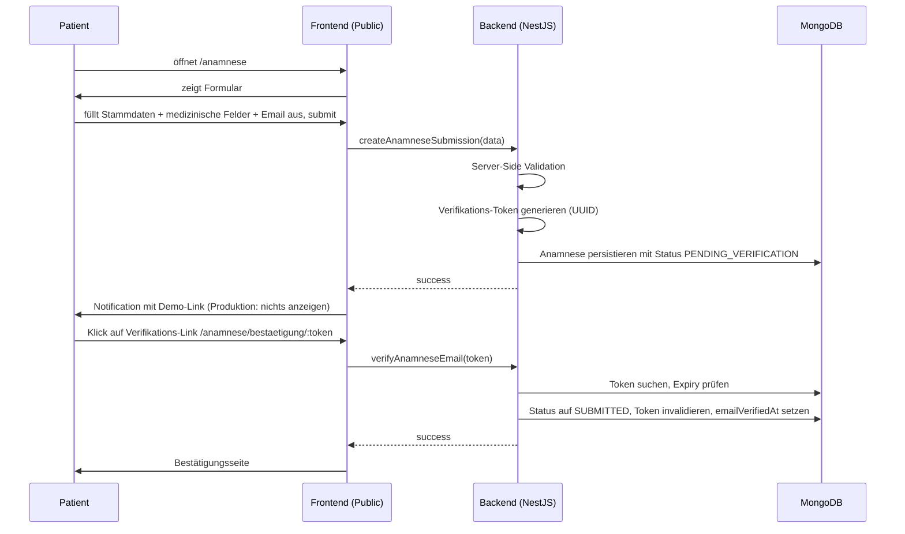

# Auth-Konzept öffentlicher Anamnesebogen

> Status: Akzeptiert
> Letztes Update: 2026-05-11

## Problem und Anforderungen

Aus der Aufgabenstellung:

> Anamnesebogen, der öffentlich für einen Patienten aufrufbar ist und Daten erfasst.
>
> Konzepte für Authentifizierung/Autorisierung und Security für Backoffice Applikation und öffentlichem Anamnesebogen.

Daraus folgt:

- Bogen wird ohne Login aufgerufen
- Eingabe muss trotzdem an eine identifizierbare Person gebunden sein
- Spam und Bot-Submits müssen verhindert werden
- Sensible Daten (DSGVO Art. 9) erfordern Sorgfalt bei Speicherung und Sichtbarkeit

## Designentscheidung

Identitätsbindung erfolgt über **Email-Verifikation während der Submission** (Double-Opt-In). Der Patient gibt seine Email an, das System sendet einen Bestätigungslink, erst nach Klick gilt der Bogen als eingereicht.

Kein vorab-vergebener Token-Link von der Klinik. Kein Patient-Login. Siehe [ADR-0007](adr/0007-public-auth-email-verification.md) für die Optionen-Abwägung.

## Patient-Flow

## Verifikations-Token

Eigenschaften:

| Eigenschaft | Wert |
|---|---|
| Erzeugung | `crypto.randomUUID()` |
| Speicherung | DB-gebunden auf der Anamnese-Entität, nicht als JWT |
| Expiry | 24 Stunden |
| Konsumierbarkeit | einmalig, beim Klick invalidiert |
| Datenmodell | Felder `emailVerificationToken`, `emailVerificationTokenExpiresAt`, `emailVerifiedAt` auf `Anamnese` |

## Defense-in-Depth: Geburtsdatum-Bestätigung

Konzeptuell kann beim Klick auf den Bestätigungslink zusätzlich das Geburtsdatum abgefragt werden. Erst bei Übereinstimmung wird der Status auf `SUBMITTED` gesetzt. Schützt vor Token-Leaks (z.B. weitergeleitete Mail, kompromittiertes Postfach).

Nicht implementiert in der Demo.

## Mail-Versand: Demo vs. Produktion

### Demo-Pfad

In der Demo wird kein Mail-Versand implementiert. SMTP-Provider, Mail-Catcher (MailHog/Mailpit) und ähnliche Infrastruktur sind out of scope.

Stattdessen wird der Verifikations-Link im Frontend nach dem Submit als Notification angezeigt.

### Produktions-Pfad

In Produktion würde der Link ausschließlich per Email an die angegebene Adresse versendet. Anzeige im Frontend oder Backoffice darf nicht erfolgen, weil das die Email-Verifikation aushebeln würde: jemand mit fremder Email als Eingabe könnte sich sonst selbst den Link verschaffen.

Implementierungs-Skizze für Produktion:

- Transactional Mail-Service (z.B. SMTP über `nodemailer`)
- Mail-Template mit Klinik-Branding, Verifikations-Link, Hinweis zur Expiry
- Bounce-Handling und Versand-Audit
- Out of scope für die Demo

## Endpoint-Schutz

Unabhängig von der Identitäts-Bindung gilt für den Public-Submit-Endpoint:

| Schutz | Demo | Produktion |
|---|---|---|
| Captcha | nicht implementiert | hCaptcha oder vergleichbar, Pflicht |
| Rate Limiting | nicht implementiert | NestJS Throttler, z.B. 5 Submits / 10 Min pro IP |
| Server-Side Validation | `class-validator` auf Input-DTO | identisch |
| Input-Sanitisierung | nicht implementiert | NestJS Pipes mit Sanitizer für Freitext-Felder |
| HTTPS | n/a für lokales Setup | Pflicht |

## GraphQL-Operations-Trennung

Public und Backoffice nutzen klar getrennte GraphQL-Operationen mit unterschiedlichen Auth-Strategies:

| Operation | Auth-Strategy | Sichtbar für |
|---|---|---|
| `createAnamneseSubmission` | keine User-Auth, Captcha + Rate Limit als Schutz | Public |
| `verifyAnamneseEmail(token)` | Token-Validierung gegen DB | Public |
| `listAnamnesen`, `getOneAnamnese`, `transition` | SessionStorage-Guard (Backoffice-Stub) | Mitarbeitende |

Vorteil der Trennung: keine versehentliche Kreuz-Auth, klares Mental-Model für Reviewer und spätere Pflege.

## Was Email-Verifikation leistet, was nicht

Was sie leistet:

- Bestätigt, dass die angegebene Email-Adresse erreichbar ist und vom Submitter kontrolliert wird
- Verhindert Spam mit gefälschten oder zufälligen Adressen
- Bindet den Bogen an eine Email-Identität

Was sie **nicht** leistet:

- Bestätigt nicht, dass die angegebenen Stammdaten (Name, Geburtsdatum) zur realen Person der Email gehören
- Bietet keinen Schutz vor Identitätsmissbrauch (jemand füllt mit fremden Stammdaten aus, aber eigener Email)

Konsequenz: Plausibilitätsprüfung im Backoffice bleibt nötig. Im Status `IN_REVIEW` matcht die Mitarbeiterin die Stammdaten gegen die Patientenkartei. Bei Unklarheiten Rückruf des Patienten unter der angegebenen Telefonnummer.

## Bezug zum Statusmodell

Public-Auth-bezogene Status:

- `PENDING_VERIFICATION`: Bogen wurde abgesendet, Email-Klick steht aus
- `SUBMITTED`: Email-Klick erfolgt, Bogen liegt zur Sichtung im Backoffice
- `EXPIRED`: 48h ohne Klick, automatischer Übergang

Vollständiges Statusmodell siehe [docs/statusmodell.md](statusmodell.md).

## Was im Repo demonstriert wird

- Server-Side Validation mit `class-validator` auf dem Input-DTO
- Verifikations-Token-Generierung mit `crypto.randomUUID()`
- Token-Expiry-Validierung (24h)
- Status-Übergang `PENDING_VERIFICATION → SUBMITTED` durch Token-Konsum
- Anzeige des Verifikations-Links in Frontend-Notification und Backoffice-Detail-Ansicht
- Klare Trennung Public- vs. Backoffice-GraphQL-Operationen

## Was im Konzept beschrieben aber nicht implementiert ist

- Echter SMTP-Mail-Versand, Mail-Template, Bounce-Handling
- Captcha
- Rate Limiting
- Input-Sanitisierung für Freitext-Felder
- Defense-in-Depth Geburtsdatum-Bestätigung beim Verifikations-Klick
- SMS-Verifikation als Alternative oder Ergänzung
- Resend-Funktion auf Patienten-Seite

## Verweis

[ADR-0007: Public-Auth mit Email-Verifikation](adr/0007-public-auth-email-verification.md)
