# SSO-Konzept Backoffice

> Status: Akzeptiert
> Letztes Update: 2026-05-04

## Motivation

Die Demo-Implementierung nutzt Username/Passwort mit lokalem JWT (siehe ADR-0006). In Produktion würde das durch eine Anbindung an den Identity-Provider der Klinik ersetzt. Dieses Papier beschreibt den Produktiv-Pfad.

Treiber für SSO in Produktion:

- Single Sign-On für Mitarbeitende, die bereits in einem zentralen IdP geführt sind
- Zentrale Account-Lifecycle-Verwaltung (On-/Offboarding über IdP)
- MFA und Conditional Access werden vom IdP gestellt, nicht in der Anwendung dupliziert
- Audit-Log auf IdP-Seite für Login-Events, kein lokales Password-Storage in der Anwendung

## Demo vs. Produktion

| Aspekt | Demo | Produktion |
|---|---|---|
| Auth-Mechanismus | Username/Passwort, lokales JWT | OAuth 2.0 Authorization Code Flow mit PKCE über IdP |
| User-Verwaltung | Seed-User in MongoDB | User aus IdP, kein lokales Password-Storage |
| Access-Token | JWT signed mit Server-Secret | JWT vom IdP, lokal validiert über JWKS |
| Rollen | statisch in DB | aus IdP-Claims (App-Roles oder Groups) |
| Logout | Client-Verwerfung des Tokens | Front-Channel-Logout-Redirect zum IdP |
| MFA | nicht in Demo | im IdP konfiguriert |

Die Konzept-Implementierung würde technisch über `@nestjs/passport` mit OIDC-Strategy (z.B. `passport-azure-ad`) und auf Frontend-Seite über `oidc-client-ts` oder `angular-auth-oidc-client` laufen.

## OAuth 2.0 Authorization Code Flow mit PKCE

```mermaid
sequenceDiagram
    participant U as User
    participant SPA as Frontend (Backoffice)
    participant IdP as Entra ID
    participant API as Backend (NestJS)

    U->>SPA: Klick „Login"
    SPA->>SPA: code_verifier und code_challenge erzeugen
    SPA->>IdP: Redirect /authorize mit code_challenge, state, nonce
    IdP->>U: Login-Maske, ggf. MFA, ggf. Consent
    U->>IdP: Credentials
    IdP->>SPA: Redirect mit authorization_code, state
    SPA->>SPA: state validieren
    SPA->>IdP: POST /token { code, code_verifier }
    IdP-->>SPA: { id_token, access_token, refresh_token }
    SPA->>SPA: Tokens speichern (Access in Memory, Refresh als httpOnly Cookie)
    SPA->>API: Request mit Authorization: Bearer access_token
    API->>API: Token-Signatur via JWKS validieren, Claims prüfen
    API-->>SPA: Response
```

### Schlüsseleigenschaften

- **PKCE**: Pflicht für SPAs. Schützt gegen Authorization-Code-Interception, weil der Code ohne `code_verifier` nicht einlösbar ist
- **State-Parameter**: schützt gegen CSRF beim Redirect zurück
- **Nonce im ID Token**: schützt gegen Token-Replay
- **Public Client**: SPAs haben kein Client-Secret, daher PKCE statt Secret

## IdP-Wahl

Primär als Beispiel verwendet: **Entra ID** (vormals Azure AD). Begründung: Schön Klinik vermutlich Microsoft-lastig (Office 365, Azure).

Das Konzept ist nicht IdP-spezifisch, sondern lehnt sich an OIDC. Mit identischen Pattern umsetzbar:

- Keycloak (Self-hosted Open Source)
- Auth0 oder Okta (SaaS)

Patient-Login (z.B. via Azure AD B2C) ist explizit nicht Teil dieses Konzepts. Patient-Auth ist im `docs/auth-public-bogen.md` als Email-Verifikation gelöst.

## Token-Strategie

| Token | Zweck | Lifetime | Speicherort Frontend |
|---|---|---|---|
| ID Token | OIDC, User-Claims (sub, email, name, roles), für UI-Personalisierung | meist 60 min | Memory |
| Access Token | OAuth 2.0, Bearer für API-Aufrufe | 15-60 min | Memory |
| Refresh Token | langlebig, für Access-Token-Erneuerung | 8-24h, ggf. Sliding | httpOnly Cookie, SameSite=Lax, Secure |

### Backend-Validierung

Access Token ist signiertes JWT vom IdP. Backend validiert:

- Signatur über IdP-JWKS (Public Keys, periodisch refreshed)
- `iss` (Issuer): muss gegen erwartete IdP-Issuer-URL prüfen
- `aud` (Audience): muss gegen eigene Client-ID prüfen
- `exp` (Expiry): nicht abgelaufen
- `nbf` (Not before): falls vorhanden, gültig

Keine Round-Trip pro Request zur IdP, lokale Validierung reicht.

## Rollen-Mapping

Primär empfohlen: **App-Roles** in Entra ID.

- Anwendung wird im Entra ID als App-Registration angelegt mit definierten App-Roles, z.B. `Anamnese.Staff`, `Anamnese.Admin`
- Mitarbeitende werden den App-Roles zugewiesen (manuell oder via Gruppen-Zuordnung)
- Access Token enthält `roles`-Claim als Array
- Backend extrahiert `roles` und mappt auf interne Rollen `STAFF`, `ADMIN`

Alternative: **Group-Claims**. Access Token enthält `groups`-Claim mit Group-Object-IDs. Backend hält ein Mapping Group-ID-zu-Rolle. Weniger sauber als App-Roles, aber pragmatisch wenn Klinik bereits Group-Strukturen pflegt.

## Logout

**Front-Channel Logout** als Standard für SPAs:

- Frontend leitet Browser zu IdP-`/logout`-Endpoint mit `post_logout_redirect_uri`
- IdP invalidiert seine Session und leitet zurück
- Frontend löscht lokale Tokens (Memory plus Refresh-Cookie)

**Back-Channel Logout** (Server-zu-Server-Notification) ist hauptsächlich für Multi-Tenant- oder Multi-App-SSO-Szenarien sinnvoll und in der Klinik-Demo nicht relevant.

## Sicherheits-Aspekte

- PKCE Pflicht für SPA
- State und Nonce immer prüfen
- HTTPS in Produktion Pflicht
- Token-Storage: Access in Memory (nicht localStorage wegen XSS-Risiko), Refresh als httpOnly Cookie mit Secure und SameSite=Lax
- JWKS-Caching mit periodischer Revalidierung (Microsoft empfiehlt z.B. 24h Cache)
- Logout muss alle drei Token invalidieren (lokal löschen plus Refresh widerrufen)
- MFA und Conditional Access werden auf IdP-Seite konfiguriert, nicht in der Anwendung

## Multi-Tenancy

Schön Klinik betreibt mehrere Häuser. Falls jedes Haus ein eigenes Entra-ID-Tenant hat: Multi-Tenant-App-Registration in Entra ID. Tenant-ID wird im `/authorize`-URL mitgegeben. Backend muss `iss` gegen erlaubte Tenant-Issuers prüfen.

In Demo Out-of-Scope.

## Was im Demo implementiert wird (Verweis auf ADR-0006)

- Login-Form mit Email und Passwort
- JWT lokal signed mit Server-Secret, Lifetime z.B. 8h (kein Refresh in Cut-Stufe 2)
- Argon2id Password-Hashing
- Zwei Rollen statisch in DB: `STAFF` und `ADMIN`
- Logout: Client-Verwerfung des Tokens (kein IdP-Logout-Redirect, da kein IdP in Demo)

## Was im Konzept beschrieben aber nicht implementiert ist

- OAuth 2.0 Authorization Code Flow mit PKCE
- Entra-ID-Integration via `@nestjs/passport` mit OIDC-Strategy
- JWKS-Validierung im Backend
- Rollen-Mapping aus Token-Claims
- Front-Channel Logout
- MFA und Conditional Access (auf IdP-Seite)
- Multi-Tenant-Support
- Refresh-Token-Rotation gegen IdP

## Verweise

- ADR-0006: Backoffice-Auth mit JWT (Demo-Pfad)
- Architektur: `docs/architektur.md` (Komponenten und Schnittstellen)
