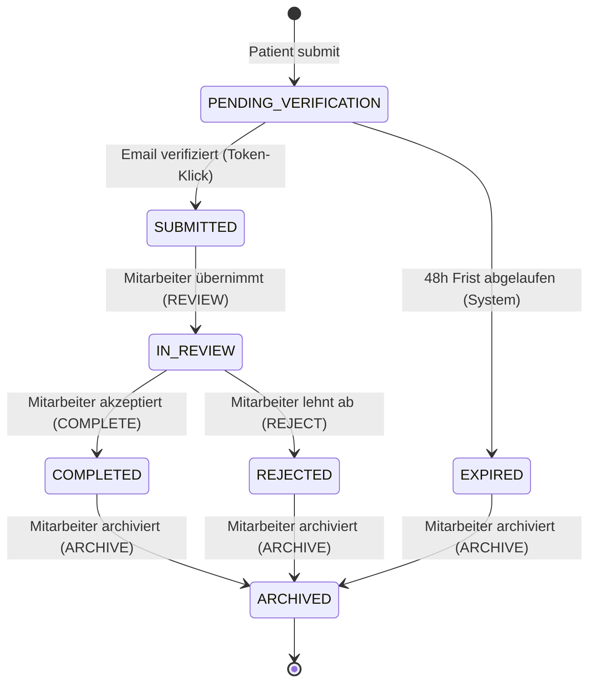

# Statusmodell des Anamnesebogens

> Status: Akzeptiert
> Letztes Update: 2026-05-11

## Motivation

Die Aufgabenstellung verlangt explizit ein Statusmodell zur Verwaltung des Anamnesebogens im Backoffice:

> Im Backoffice können authentifizierte Mitarbeitende den Bogen bearbeiten und über ein Statusmodell verwalten.

Das Statusmodell ist damit zentrales Designelement der Anwendung. Ziele:

- Alle Lebensphasen eines Bogens abbilden (Submission, Verifikation, Sichtung, Abschluss, Archivierung)
- Erlaubte Übergänge explizit machen, statt sie willkürlich erlaubt zu lassen
- Als zentrale State Machine in einem Service implementieren, gut testbar und änderungsstabil

## Status-Liste

| Status                 | Bedeutung                                                                                          |
| ---------------------- | -------------------------------------------------------------------------------------------------- |
| `PENDING_VERIFICATION` | Patient hat Bogen abgesendet, Email-Klick steht aus                                                |
| `SUBMITTED`            | Email verifiziert, Bogen wartet auf Sichtung im Backoffice                                         |
| `IN_REVIEW`            | Mitarbeiter prüft den Bogen, ggf. Stammdaten-Match mit Patientenkartei, ggf. inhaltliche Ergänzung |
| `COMPLETED`            | Bogen akzeptiert, freigegeben für klinische Verwendung                                             |
| `REJECTED`             | Bogen abgelehnt (z.B. unplausibel, unvollständig, Stammdaten-Match fehlgeschlagen)                 |
| `EXPIRED`              | 48h ohne Email-Klick, Verifikations-Token abgelaufen                                               |
| `ARCHIVED`             | Bogen aus aktivem Workflow entfernt, weiterhin lesbar (Endzustand)                                 |

## State Chart



## Übergangs-Tabelle

| Von                    | Zu                     | Trigger                          | Akteur                     | Bedingung                                       |
| ---------------------- | ---------------------- | -------------------------------- | -------------------------- | ----------------------------------------------- |
| (initial)              | `PENDING_VERIFICATION` | `createAnamneseSubmission(data)` | Patient (Public)           | Validation bestanden                            |
| `PENDING_VERIFICATION` | `SUBMITTED`            | `verifyAnamneseEmail(token)`     | Patient (Public) via Klick | Token gültig und nicht abgelaufen               |
| `SUBMITTED`            | `IN_REVIEW`            | `transition(id, REVIEW)`         | Mitarbeiter (Backoffice)   | -                                               |
| `IN_REVIEW`            | `COMPLETED`            | `transition(id, COMPLETE)`       | Mitarbeiter (Backoffice)   | -                                               |
| `IN_REVIEW`            | `REJECTED`             | `transition(id, REJECT)`         | Mitarbeiter (Backoffice)   | -                                               |
| `COMPLETED`            | `ARCHIVED`             | `transition(id, ARCHIVE)`        | Mitarbeiter (Backoffice)   | -                                               |
| `REJECTED`             | `ARCHIVED`             | `transition(id, ARCHIVE)`        | Mitarbeiter (Backoffice)   | -                                               |
| `PENDING_VERIFICATION` | `EXPIRED`              | Hintergrundjob                   | System                     | Nicht implementiert (Demo läuft nur kurzzeitig) |

Alle anderen Übergänge sind verboten und werfen einen Fehler.

## Inhaltliche Bearbeitung

Konzeptuell ist Schreibzugriff auf medizinische Felder durch Mitarbeitende nur in `IN_REVIEW` erlaubt. In allen anderen Status:

- `PENDING_VERIFICATION`: keine Bearbeitung. Patient hat noch nicht endgültig eingereicht
- `SUBMITTED`: keine Bearbeitung. Mitarbeiter muss erst Verantwortung übernehmen mit Action `REVIEW`
- `COMPLETED`, `REJECTED`, `EXPIRED`, `ARCHIVED`: keine Bearbeitung. Status ist final

### In der Demo nicht implementiert:

- Mitarbeitende können in der Demo Bögen lesen und Status-Aktionen ausführen, aber keine medizinischen Felder ändern.
- Patientenseitig findet keine inhaltliche Bearbeitung statt. Der Patient submittet einmal und kann den Bogen danach nicht mehr ändern. Eine spätere Patient-Bearbeitung (z.B. Draft-Speichern während des Ausfüllens, Korrektur vor Email-Klick) wäre möglich.
- Nicht reaktivierbar in der Demo: einmal `COMPLETED` oder `REJECTED` gesetzt, kein Rückweg. In Produktion könnten Korrektur-Übergänge erlaubt werden (z.B. `REJECTED → IN_REVIEW`), das hätte aber Audit-Konsequenzen und müsste eigens spezifiziert werden.

## Berechtigungen

Aktoren:

- **System** für automatische Übergänge: Patient-Submit (initial `PENDING_VERIFICATION`), Email-Verifikation (`SUBMITTED`). Expiry-Job (`EXPIRED`) konzeptuell vorgesehen, nicht implementiert.
- **Mitarbeiter (Backoffice)**: manuelle Übergänge ab `SUBMITTED`
- **ADMIN**: konzeptuell identisch zu STAFF, zusätzlich Audit-Log-Zugriff (siehe [docs/audit-log-konzept.md](audit-log-konzept.md)). Nicht implementiert in der Demo — das Backoffice-Auth ist ein SessionStorage-Stub ohne Rollentrennung.

## Action-basierte API

Statt direktem `setStatus` exponiert die GraphQL-API eine action-basierte Mutation:

```graphql
mutation transition(anamneseId: ID!, action: AnamneseAction!): Anamnese!

enum AnamneseAction {
  REVIEW
  COMPLETE
  REJECT
  ARCHIVE
}
```

Vorteile:

- Mitarbeitende können nicht beliebige Status setzen, nur erlaubte Aktionen aufrufen
- Mapping Action zu neuem Status liegt im Service, nicht beim Client
- Frontend-Buttons binden direkt auf Aktionen, keine Status-Logik im UI

Eigene Mutationen für Spezialfälle:

- `verifyAnamneseEmail(token: String!)`: Public-Mutation, übernimmt `PENDING_VERIFICATION → SUBMITTED`
- `createAnamneseSubmission(data: ...)`: Public-Mutation, erzeugt initial `PENDING_VERIFICATION`

## State Machine im Service-Design

Implementierung: `apps/backend/src/anamnese/status/`

- `transition.type.ts`: Übergangstabelle als Array von `{ from, action, to }`-Objekten
- `status.service.ts`: `transition(status, action)` validiert gegen die Tabelle und wirft `BadRequestException` bei ungültigem Übergang
- `status.service.spec.ts`: Unit-Tests für alle erlaubten und mehrere unerlaubte Übergänge

`transition.type.ts` enthält außerdem einen auskommentierten Vergleich zur State-Pattern-Alternative, der die Entscheidung für die Übergangstabelle veranschaulicht.

## Automatisierte Übergänge

Konzeptuell gibt es einen automatischen Übergang: `PENDING_VERIFICATION → EXPIRED`. In der Demo nicht implementiert, da die App nur kurzzeitig läuft und ein Hintergrundjob nie sinnvoll triggern würde.

In Produktion: Hintergrundjob (z.B. NestJS Scheduler über `@Cron`), der periodisch alle `PENDING_VERIFICATION` älter als 48h auf `EXPIRED` setzt und einen Audit-Eintrag erzeugt.

## Was im Repo demonstriert wird

- 6 von 7 Status mit vollständiger Übergangs-Validierung (`EXPIRED` im Enum vorhanden, aber nicht erreichbar)
- `AnamneseStatusService` als zentrale State Machine mit deklarativer Übergangstabelle
- Action-basierte GraphQL-Mutation `transitionAnamneseStatus`
- Eigene Mutationen `verifyAnamneseEmail` und `createAnamneseSubmission` für die Public-Spezialfälle
- Unit-Tests für die State Machine (alle erlaubten und mehrere unerlaubte Übergänge)
- Demonstration aller manuellen Pfade über das Backoffice-UI

## Was im Konzept beschrieben aber nicht implementiert ist

- Mitarbeiter-Inhaltsbearbeitung in `IN_REVIEW` (Cut-Stufe 2: nicht in Demo)
- Patient-seitige Inhaltsbearbeitung (z.B. Draft-Speichern während des Ausfüllens, Korrektur vor Email-Klick) als Nice-to-have
- `EXPIRED`-Übergang über Hintergrundjob nicht implementiert: die Demo-App läuft nur kurzzeitig, ein Cron-Job würde nie sinnvoll triggern. `EXPIRED` ist im Enum vorhanden, ist aber in der Demo nicht erreichbar.
- Korrektur-Übergänge (z.B. `REJECTED → IN_REVIEW`)
- Bulk-Archivierung im Backoffice-UI
- Reporting und Statistiken pro Status

## Verweise

- Public-Auth: [docs/auth-public-bogen.md](auth-public-bogen.md) (definiert Initial-Übergang in `PENDING_VERIFICATION` und Übergang nach `SUBMITTED`)
- Audit-Log: [docs/audit-log-konzept.md](audit-log-konzept.md) (jede Status-Transition erzeugt einen Audit-Eintrag)
