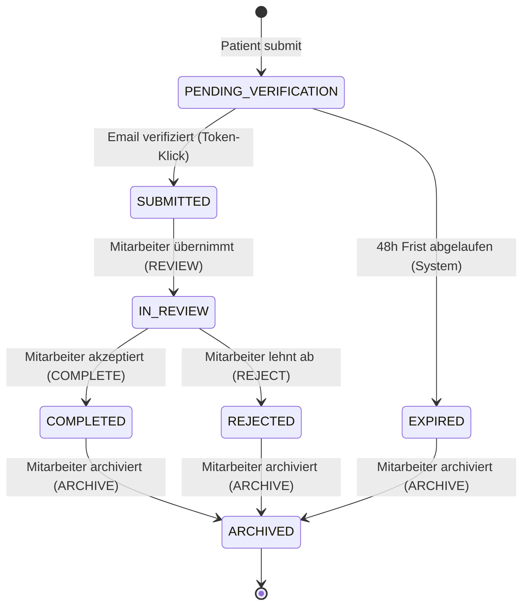

# Statusmodell des Anamnesebogens

> Status: Akzeptiert
> Letztes Update: 2026-05-04

## Motivation

Die Aufgabenstellung verlangt explizit ein Statusmodell zur Verwaltung des Anamnesebogens im Backoffice:

> Im Backoffice können authentifizierte Mitarbeitende den Bogen bearbeiten und über ein Statusmodell verwalten.

Das Statusmodell ist damit zentrales Designelement der Anwendung. Ziele:

- Alle Lebensphasen eines Bogens abbilden (Submission, Verifikation, Sichtung, Abschluss, Archivierung)
- Erlaubte Übergänge explizit machen, statt sie willkürlich erlaubt zu lassen
- Als zentrale State Machine in einem Service implementieren, gut testbar und änderungsstabil

## Status-Liste

| Status | Bedeutung |
|---|---|
| `PENDING_VERIFICATION` | Patient hat Bogen abgesendet, Email-Klick steht aus |
| `SUBMITTED` | Email verifiziert, Bogen wartet auf Sichtung im Backoffice |
| `IN_REVIEW` | Mitarbeiter prüft den Bogen, ggf. Stammdaten-Match mit Patientenkartei, ggf. inhaltliche Ergänzung |
| `COMPLETED` | Bogen akzeptiert, freigegeben für klinische Verwendung |
| `REJECTED` | Bogen abgelehnt (z.B. unplausibel, unvollständig, Stammdaten-Match fehlgeschlagen) |
| `EXPIRED` | 48h ohne Email-Klick, Verifikations-Token abgelaufen |
| `ARCHIVED` | Bogen aus aktivem Workflow entfernt, weiterhin lesbar (Endzustand) |

## State Chart



## Übergangs-Tabelle

| Von | Zu | Trigger | Akteur | Bedingung |
|---|---|---|---|---|
| (initial) | `PENDING_VERIFICATION` | `createAnamneseSubmission(data)` | Patient (Public) | Captcha (Produktion), Rate Limit, Validation bestanden |
| `PENDING_VERIFICATION` | `SUBMITTED` | `verifyAnamneseEmail(token)` | Patient (Public) via Klick | Token gültig und nicht abgelaufen |
| `PENDING_VERIFICATION` | `EXPIRED` | Hintergrundjob (TODO in Demo) | System | erstellt vor mehr als 48h, kein Klick erfolgt |
| `SUBMITTED` | `IN_REVIEW` | `transitionAnamneseStatus(id, REVIEW)` | STAFF, ADMIN | - |
| `IN_REVIEW` | `COMPLETED` | `transitionAnamneseStatus(id, COMPLETE)` | STAFF, ADMIN | - |
| `IN_REVIEW` | `REJECTED` | `transitionAnamneseStatus(id, REJECT)` | STAFF, ADMIN | - |
| `COMPLETED` | `ARCHIVED` | `transitionAnamneseStatus(id, ARCHIVE)` | STAFF, ADMIN | - |
| `REJECTED` | `ARCHIVED` | `transitionAnamneseStatus(id, ARCHIVE)` | STAFF, ADMIN | - |
| `EXPIRED` | `ARCHIVED` | `transitionAnamneseStatus(id, ARCHIVE)` | STAFF, ADMIN | - |

Alle anderen Übergänge sind verboten und werfen einen Fehler.

## Inhaltliche Bearbeitung

Konzeptuell ist Schreibzugriff auf medizinische Felder durch Mitarbeitende nur in `IN_REVIEW` erlaubt. In allen anderen Status:

- `PENDING_VERIFICATION`: keine Bearbeitung. Patient hat noch nicht endgültig eingereicht
- `SUBMITTED`: keine Bearbeitung. Mitarbeiter muss erst Verantwortung übernehmen mit Action `REVIEW`
- `COMPLETED`, `REJECTED`, `EXPIRED`, `ARCHIVED`: keine Bearbeitung. Status ist final

**In der Demo nicht implementiert (Cut-Stufe 2).** Mitarbeitende können in der Demo Bögen lesen und Status-Aktionen ausführen, aber keine medizinischen Felder ändern. Begründung: bewusste Scope-Reduktion im Sinne der Aufgabenstellungs-Klausel „nicht notwendig die Applikation an allen Stellen zu 100% auszuprogrammieren". Konzept und Service-Pfad für die Bearbeitung sind hier dokumentiert.

Patientenseitig findet keine inhaltliche Bearbeitung statt. Der Patient submittet einmal und kann den Bogen danach nicht mehr ändern. Eine spätere Patient-Bearbeitung (z.B. Draft-Speichern während des Ausfüllens, Korrektur vor Email-Klick) wäre Nice-to-have, in der Demo nicht implementiert.

Nicht reaktivierbar in der Demo: einmal `COMPLETED` oder `REJECTED` gesetzt, kein Rückweg. Begründung: Demo-Vereinfachung. In Produktion könnte man Korrektur-Übergänge erlauben (z.B. `REJECTED → IN_REVIEW`), das hätte aber Audit-Konsequenzen und müsste eigens spezifiziert werden.

## Berechtigungen

Aktoren:

- **System** für automatische Übergänge: Patient-Submit (initial `PENDING_VERIFICATION`), Email-Verifikation (`SUBMITTED`), Expiry-Job (`EXPIRED`)
- **STAFF** (Backoffice-Mitarbeiter, JWT): manuelle Übergänge ab `SUBMITTED`
- **ADMIN** (Backoffice-Admin, JWT): identisch zu STAFF, zusätzlich Audit-Log-Zugriff (siehe `docs/audit-log-konzept.md`)

Für Status-Transitions reicht STAFF. ADMIN bringt für das Statusmodell selbst keine zusätzlichen Rechte.

## Action-basierte API

Statt direktem `setStatus` exponiert die GraphQL-API eine action-basierte Mutation:

```graphql
mutation transitionAnamneseStatus(id: ID!, action: AnamneseAction!): Anamnese!

enum AnamneseAction {
  REVIEW
  COMPLETE
  REJECT
  ARCHIVE
}
```

Vorteile:

- Mitarbeitende können nicht beliebige Status setzen, nur erlaubte Aktionen aufrufen
- Mapping Action zu neuem Status liegt im Service, nicht beim Client
- Frontend-Buttons binden direkt auf Aktionen, keine Status-Logik im UI

Eigene Mutationen für Spezialfälle:

- `verifyAnamneseEmail(token: String!)`: Public-Mutation, übernimmt `PENDING_VERIFICATION → SUBMITTED`
- `createAnamneseSubmission(data: ...)`: Public-Mutation, erzeugt initial `PENDING_VERIFICATION`

## State Machine im Service-Design

Skizze des `AnamneseStatusService`. Pseudo-Code, nicht endgültige Implementierung:

```ts
class AnamneseStatusService {
  private readonly transitions = new Map<AnamneseStatus, Map<AnamneseAction, AnamneseStatus>>([
    [SUBMITTED,  new Map([['REVIEW',   IN_REVIEW]])],
    [IN_REVIEW,  new Map([['COMPLETE', COMPLETED], ['REJECT', REJECTED]])],
    [COMPLETED,  new Map([['ARCHIVE',  ARCHIVED]])],
    [REJECTED,   new Map([['ARCHIVE',  ARCHIVED]])],
    [EXPIRED,    new Map([['ARCHIVE',  ARCHIVED]])],
  ])

  async transition(id: string, action: AnamneseAction, actor: User): Promise<Anamnese> {
    const anamnese = await this.repo.findById(id)
    const next = this.transitions.get(anamnese.status)?.get(action)
    if (!next) throw new InvalidTransitionError(anamnese.status, action)

    const updated = await this.repo.updateStatus(id, next)
    await this.auditService.recordTransition(id, anamnese.status, next, action, actor)
    return updated
  }
}
```

Eigenschaften:

- Übergangstabelle als Datenstruktur, nicht als verstreute `if/switch`-Logik
- Reine State-Validierung trennbar von DB-Persistenz, gut testbar (Unit-Test pro erlaubter und unerlaubter Übergang)
- Audit-Eintrag als integraler Teil des Übergangs

## Automatisierte Übergänge

Nur ein automatischer Übergang: `PENDING_VERIFICATION → EXPIRED`. Optionen:

- **Demo:** TODO-Markierung im Code, kein Job implementiert. Anamnesen mit abgelaufener Frist bleiben sichtbar im Status `PENDING_VERIFICATION`. README dokumentiert die Vereinfachung
- **Produktion:** Hintergrundjob (z.B. NestJS Scheduler über `@Cron`, oder externer Worker), der periodisch alle `PENDING_VERIFICATION` älter als 48h auf `EXPIRED` setzt und einen Audit-Eintrag erzeugt
- **Alternative für Produktion:** lazy beim Read prüfen (bei jedem Query auf eine Anamnese, ob die Frist abgelaufen ist). Vorteil: kein Job nötig. Nachteil: Status wird erst bei Read aktuell, ungeeignet für Reporting und Statistiken

In der Demo: TODO mit Hinweis auf Cron-Job-Variante.

## Was im Repo demonstriert wird

- Alle 7 Status mit vollständiger Übergangs-Validierung
- `AnamneseStatusService` als zentrale State Machine mit deklarativer Übergangstabelle
- Action-basierte GraphQL-Mutation `transitionAnamneseStatus`
- Eigene Mutationen `verifyAnamneseEmail` und `createAnamneseSubmission` für die Public-Spezialfälle
- Unit-Tests für die State Machine (alle erlaubten und mehrere unerlaubte Übergänge)
- Demonstration aller manuellen Pfade über das Backoffice-UI

## Was im Konzept beschrieben aber nicht implementiert ist

- Mitarbeiter-Inhaltsbearbeitung in `IN_REVIEW` (Cut-Stufe 2: nicht in Demo)
- Patient-seitige Inhaltsbearbeitung (z.B. Draft-Speichern während des Ausfüllens, Korrektur vor Email-Klick) als Nice-to-have
- `EXPIRED`-Übergang über Hintergrundjob (TODO im Code)
- Korrektur-Übergänge (z.B. `REJECTED → IN_REVIEW`)
- Bulk-Archivierung im Backoffice-UI
- Reporting und Statistiken pro Status

## Verweise

- Public-Auth: `docs/auth-public-bogen.md` (definiert Initial-Übergang in `PENDING_VERIFICATION` und Übergang nach `SUBMITTED`)
- Audit-Log: `docs/audit-log-konzept.md` (jede Status-Transition erzeugt einen Audit-Eintrag)
